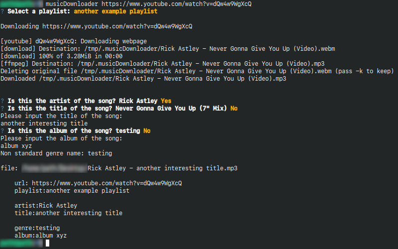
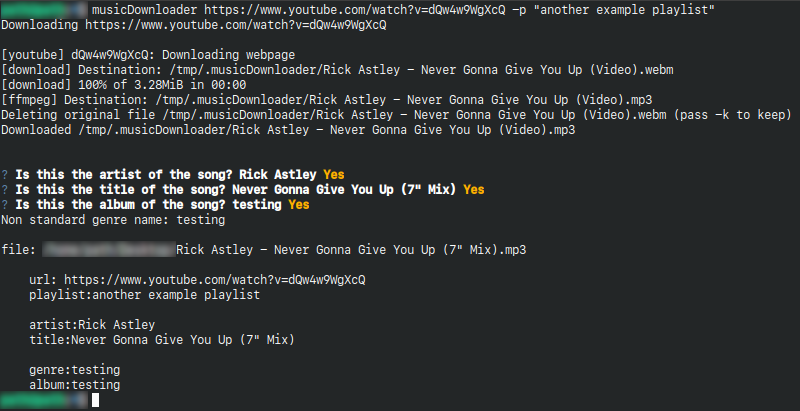

# musicDownloader

---

A python-written commandline utility to download, convert and add metadata to youtube videos

## Features

+ open source
+ commandline based
+ fast and with minimal user input

## Usage

##### without arguments:

select any given playlist *(stored in ~/.musicDownloader/resources/playlists/)* 


wait for the download to complete and select the necessary metadata


##### with arguments:

the download begins automatically, you only have to select the metadata


## Installation

if you have GNU-make installed, use:

`make install` 

else, use: 

```
pip3 install -r requirements.txt
pip3 install .
```

to install the program

## TODOS

+ add automated tests

+ add filename format input

+ make output more user friendly

+ improve automated playlist selection

+ menu to add playlists
